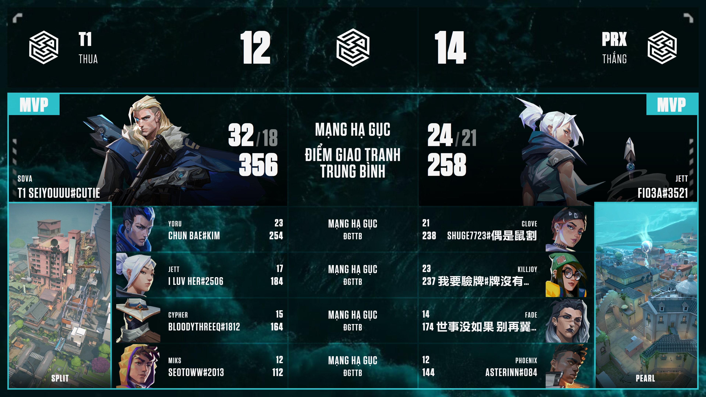

# VALORANT Postgame Stats Overlay

Overlay hiển thị kết quả trận đấu VALORANT sau trận, thiết kế cho OBS Browser Source ở độ phân giải **1920×1080**.

Sử dụng [Henrik Dev API v4](https://docs.henrikdev.xyz/) để lấy dữ liệu trận đấu.



---

## Tính năng

- Hiển thị bảng điểm đầy đủ 2 đội (agent, K/D/A, ACS, điểm số)
- Tự động nhận diện MVP của mỗi đội
- Cập nhật real-time qua SSE — không cần reload OBS
- Tùy chỉnh tên đội, logo, hình bản đồ (panel trái/phải), màu sắc, ảnh nền
- Dashboard quản lý tích hợp: lọc lịch sử trận, cấu hình overlay trực tiếp

---

## Yêu cầu

- **Python 3.10+**
- **pip**
- Tài khoản VALORANT (Riot ID: Tên#Tag)
- *(Tùy chọn)* API Key từ [henrikdev.xyz](https://docs.henrikdev.xyz/general/api-keys) để tăng giới hạn request

---

## Cài đặt

### 1. Clone repo

```bash
git clone https://github.com/YOUR_USERNAME/valorant-postgame-stats.git
cd valorant-postgame-stats
```

### 2. Tạo môi trường ảo và cài thư viện

```bash
python -m venv .venv
.venv\Scripts\activate        # Windows PowerShell
# source .venv/bin/activate   # macOS / Linux
pip install -r requirements.txt
```

### 3. Khởi động lần đầu

```bash
python app.py
```

Mở trình duyệt: [http://localhost:7123](http://localhost:7123)

Điền **Tên**, **Tag**, **Khu vực** rồi nhấn **Save & Load**. Thông tin được lưu vào `config.json`.

| Trường | Mô tả |
|--------|-------|
| `name` | Tên Riot ID (không bao gồm #tag) |
| `tag` | Tag Riot ID (không bao gồm #) |
| `region` | Khu vực: `ap` · `eu` · `na` · `kr` · `latam` · `br` |
| `platform` | `pc` hoặc `console` |
| `api_key` | *(Tùy chọn)* Henrik Dev API Key — tăng giới hạn request |

---

## Hướng dẫn sử dụng

### Tab LỊCH SỬ

1. Mở [http://localhost:7123](http://localhost:7123)
2. Dùng các nút lọc (**ALL / COMPETITIVE / UNRATED / …**) để thu hẹp danh sách
3. Nhấn vào thẻ trận đấu muốn hiển thị — overlay OBS cập nhật ngay lập tức
4. Nhấn **▶ Preview** để xem trước overlay trong tab mới

> Overlay nhận dữ liệu qua SSE (Server-Sent Events) — OBS **không cần refresh** khi bạn đổi trận.

---

### Tab OVERLAY (Cấu hình)

Chuyển sang tab **🎨 OVERLAY** để tùy chỉnh giao diện phát sóng.

#### Đội thi đấu

| Trường | Mô tả |
|--------|-------|
| Tên đội trái / phải | Hiển thị trên thanh header của overlay |
| Logo đội trái / phải | Ảnh PNG/JPG, nên dùng logo nền trong suốt (PNG) |

#### Giải đấu

| Trường | Mô tả |
|--------|-------|
| Logo giải | Hiển thị ở trung tâm header overlay |

#### Hình bản đồ (Panel)

Overlay có **2 panel bản đồ** ở cột ngoài cùng trái và phải:

1. Nhấn tab **← PANEL TRÁI** hoặc **PANEL PHẢI →** để chọn panel đang chỉnh
2. Nhấn vào ô bản đồ trong lưới để chọn ảnh (ảnh cinematic 1920×1080 từ valorant-api.com)
3. Nhấn **✕ Xóa** để bỏ chọn bản đồ cho panel đang active
4. Tên bản đồ sẽ hiển thị tự động ở dưới panel

#### Màu sắc

| Cài đặt | Mô tả |
|---------|-------|
| Màu chủ đạo | Màu accent (header, đường viền, highlight) — mặc định `#ff5a00` |
| Ô nền (tối) | Màu nền ô dữ liệu đội trái — điều chỉnh opacity |
| Ô nền 2 | Màu nền ô dữ liệu đội phải |

#### Nền Overlay

- **Ảnh nền**: tải lên ảnh JPG/PNG làm nền toàn màn hình
- **Màu nền + Opacity**: lớp màu đè lên ảnh nền, opacity `0` = trong suốt hoàn toàn

#### Giao diện

| Cài đặt | Mô tả |
|---------|-------|
| Font overlay | Font chữ sử dụng trong overlay (Tungsten, Arial, Impact, Tahoma) |
| Fallback icon | Icon mặc định khi không tìm được ảnh agent |

#### Lưu cấu hình

Nhấn **💾 Lưu & Áp dụng** — overlay OBS cập nhật ngay, không cần reload.

> Cấu hình overlay được lưu vào `overlay-config.json` (gitignored).

---

## Cài đặt OBS

1. Trong OBS, thêm nguồn **Browser Source**
2. Nhập URL: `http://localhost:7123/preview.html`
3. Đặt kích thước: **Width = 1920 / Height = 1080**
4. *(Tùy chọn)* Bật **"Refresh browser when scene becomes active"**

> Mỗi khi chọn trận mới từ dashboard, overlay cập nhật tự động — không cần bất kỳ thao tác nào trong OBS.

---

## Cấu trúc thư mục

```
valorant-postgame-stats/
├── app.py                  # Flask backend + tất cả API routes
├── config.json             # Tài khoản VALORANT (gitignored)
├── overlay-config.json     # Cấu hình overlay: logo, màu, bản đồ (gitignored)
├── requirements.txt
├── index.html              # Dashboard: lịch sử + cấu hình overlay
├── preview.html            # Overlay 1920×1080 cho OBS
├── font/                   # SVN-Tungsten (Black, Bold, Semibold, Book)
└── static/
    ├── css/
    │   ├── index.css       # Giao diện dashboard
    │   └── overlay.css     # Giao diện overlay OBS
    ├── img/
    │   └── preview.png     # Ảnh xem trước README
    └── js/
        ├── index.js        # Logic dashboard
        └── overlay.js      # Logic overlay + SSE listener
```

---

## API Endpoints

| Method | Endpoint | Mô tả |
|--------|----------|-------|
| `GET` | `/` | Dashboard chính |
| `GET` | `/preview.html` | Overlay OBS |
| `GET` | `/api/config` | Lấy cấu hình tài khoản |
| `POST` | `/api/config` | Lưu cấu hình tài khoản |
| `GET` | `/api/history` | Lịch sử trận đấu |
| `POST` | `/api/set-match` | Đẩy trận đấu lên overlay |
| `GET` | `/api/current-match` | Dữ liệu trận hiện tại |
| `GET` | `/api/overlay-config` | Lấy cấu hình overlay |
| `POST` | `/api/overlay-config` | Lưu cấu hình overlay |
| `GET` | `/api/maps` | Danh sách bản đồ + ảnh |
| `GET` | `/api/events` | SSE stream cho overlay |
