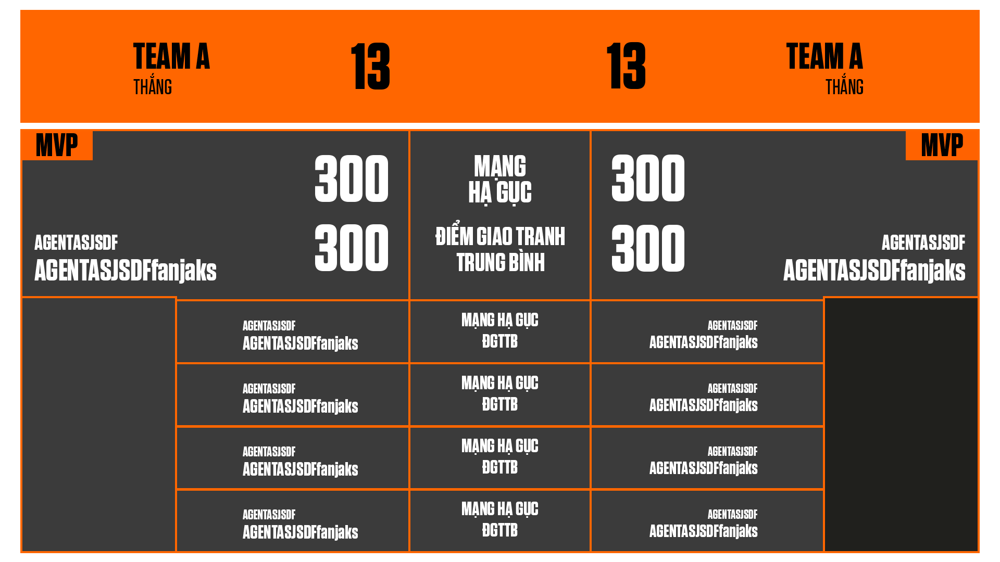

# VALORANT Postgame Stats Overlay

Overlay hiển thị kết quả trận đấu VALORANT sau trận, thiết kế cho OBS Browser Source ở độ phân giải **1920×1080**.

Sử dụng [Henrik Dev API v4](https://docs.henrikdev.xyz/) để lấy dữ liệu trận đấu.



---

## Yêu cầu

- **Python 3.10+**
- **pip**
- Tài khoản VALORANT (Riot ID: Tên#Tag)
- *(Tùy chọn)* API Key từ [henrikdev.xyz](https://docs.henrikdev.xyz/general/api-keys) để tăng giới hạn request

---

## Cài đặt

### 1. Clone repo

```bash
git clone https://github.com/YOUR_USERNAME/valorant-postgame-stats.git
cd valorant-postgame-stats
```

### 2. Tạo môi trường ảo và cài thư viện

```bash
python -m venv .venv
.venv\Scripts\activate   # Windows
pip install -r requirements.txt
```

### 3. Tạo file cấu hình

Tạo file `config.json` ở thư mục gốc với nội dung:

```json
{
  "name": "TênCủaBạn",
  "tag": "VN1",
  "region": "ap",
  "platform": "pc",
  "api_key": ""
}
```

> **Lưu ý:** `config.json` đã được thêm vào `.gitignore` để bảo vệ thông tin cá nhân.

| Trường | Mô tả |
|--------|-------|
| `name` | Tên Riot ID (không bao gồm #tag) |
| `tag` | Tag Riot ID (không bao gồm #) |
| `region` | Khu vực: `ap`, `eu`, `na`, `kr`, `latam`, `br` |
| `platform` | `pc` hoặc `console` |
| `api_key` | *(Tùy chọn)* Henrik Dev API Key |

---

## Chạy ứng dụng

```bash
python app.py
```

Mở trình duyệt và truy cập: [http://localhost:7123](http://localhost:7123)

---

## Sử dụng

1. **Chọn trận đấu** từ danh sách lịch sử trên trang chủ
2. Nhấn nút **Preview** để xem overlay
3. Hoặc trực tiếp dùng OBS như hướng dẫn bên dưới

---

## Cài đặt OBS

1. Trong OBS, thêm nguồn **Browser Source**
2. Đặt URL: `http://localhost:7123/preview.html`
3. Đặt kích thước: **1920 × 1080**
4. Bật tùy chọn **"Refresh browser when scene becomes active"** (tùy chọn)

> Mỗi khi bạn chọn trận đấu mới từ trang chủ, overlay OBS sẽ tự cập nhật khi refresh.

---

## Cấu trúc thư mục

```
valorant-postgame-stats/
├── app.py              # Flask backend
├── config.json         # Cấu hình cá nhân (gitignored)
├── requirements.txt
├── font/               # Font SVN-Tungsten
├── static/
│   ├── css/
│   │   ├── index.css   # Giao diện trang chọn trận
│   │   └── overlay.css # Giao diện overlay OBS
│   └── js/
│       ├── index.js    # Logic trang chọn trận
│       └── overlay.js  # Logic overlay OBS
├── index.html          # Trang chọn trận đấu
└── preview.html        # Overlay 1920×1080
```

---

## API Endpoints

| Method | Endpoint | Mô tả |
|--------|----------|-------|
| `GET` | `/api/config` | Lấy cấu hình hiện tại |
| `POST` | `/api/config` | Lưu cấu hình |
| `GET` | `/api/account` | Thông tin tài khoản (puuid) |
| `GET` | `/api/history` | Lịch sử trận đấu |
| `GET` | `/api/match/<id>` | Chi tiết một trận đấu |
| `POST` | `/api/set-match` | Đặt trận đấu hiện tại cho overlay |
| `GET` | `/api/current-match` | Lấy dữ liệu trận đấu hiện tại |
